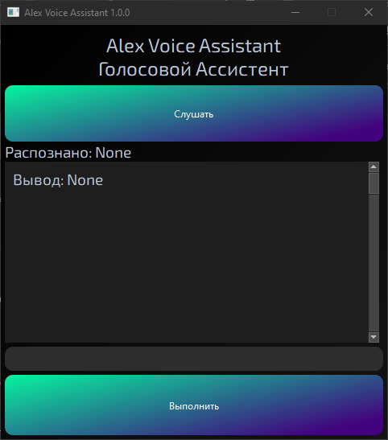

# Alex Voise Assistant

### Краткое описание
Алекс - это голосовой ассистент, который может помочь справиться с повседневной рутиной. (Писалось под версию ассистента 1.0.0, если сейчас выпущена версия выше, список возможностей может отличаться)

## Способности Алекса

- Он может сказать погодные условия в любом населённом пункте,
- может достать любую информацию из Википедии,
- запустить таймер на сказанное вами время(пока что до 59 минут)
- быстро произвести арифметический расчёт, который вы попросите(сложение, вычитание, умножение деление, возведение в степень),
- и также может быстро открыть вкладку с поиском вашего запроса

## Сборка проекта
Собирается проект командой `pyinstaller --onefile App.py` и упаковывается в папке `dist/App/App.exe`

## Технологии
|Библиотека|Версия|Использование|
|:---------|:----:|----------------------:|
|PyQt6     |6.6.1 |GUI-отображение функционала Алекса и взаимодействие с ним|
|pyttsx3   |2.90  |Синтез текста в речь|
|fuzzywuzzy|0.18.0|Сравнивание строк для правильного функционирования `brain.py`|
|wikipedia |1.4.0 |Подключение к серверам Wikipedia для сбора нужной инфомрации|
|Speech Recognition|3.10.3|Распознавание голоса и перевод в текст|

PS: Ах да, желательно, чтобы у вас был установлен Microsoft Pavel.
___
Спасибо, что пользуетесь моим голосовым ассистентом =)
